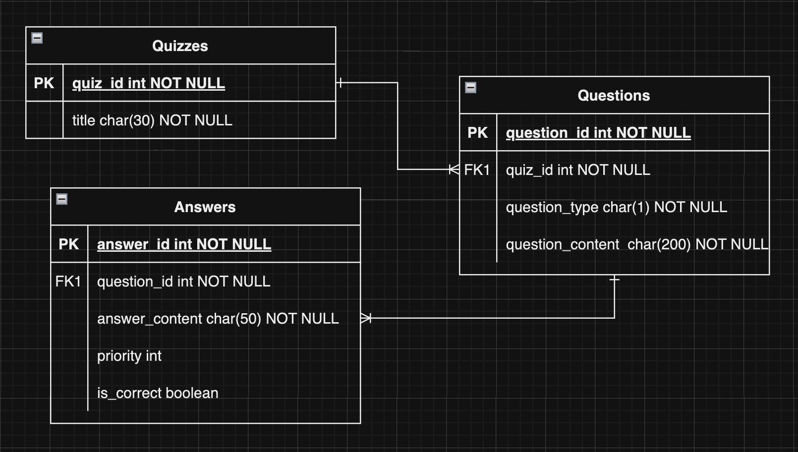
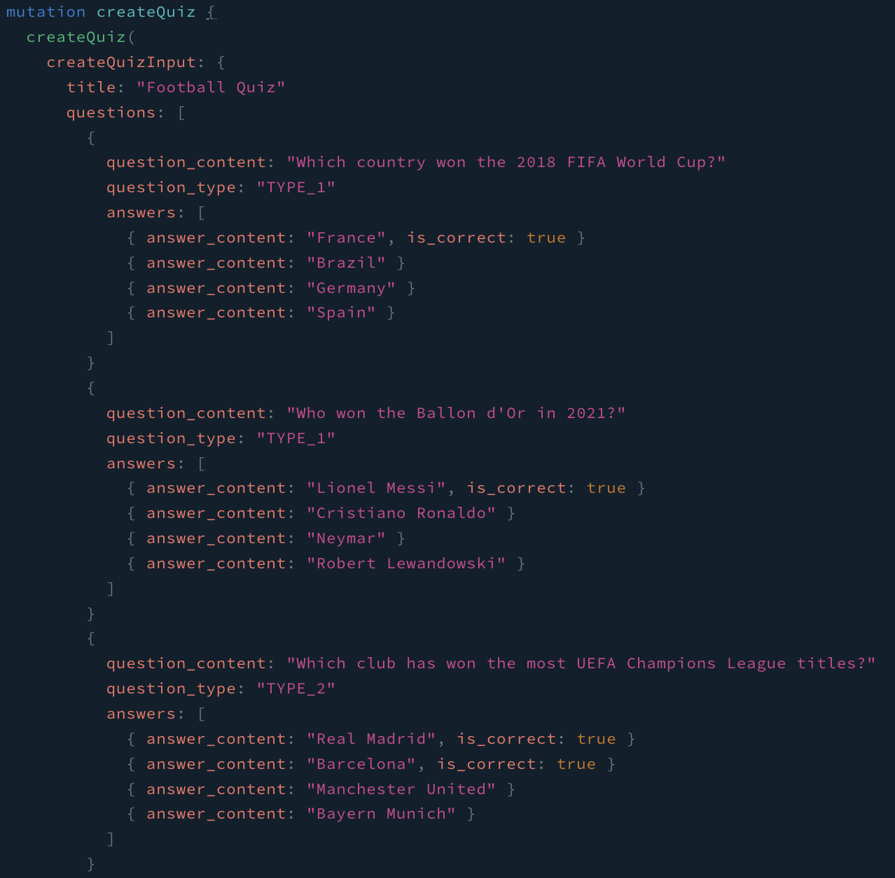
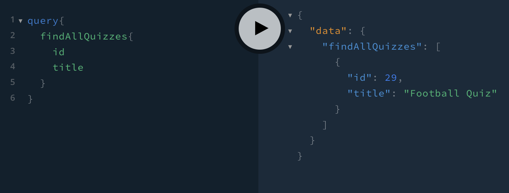
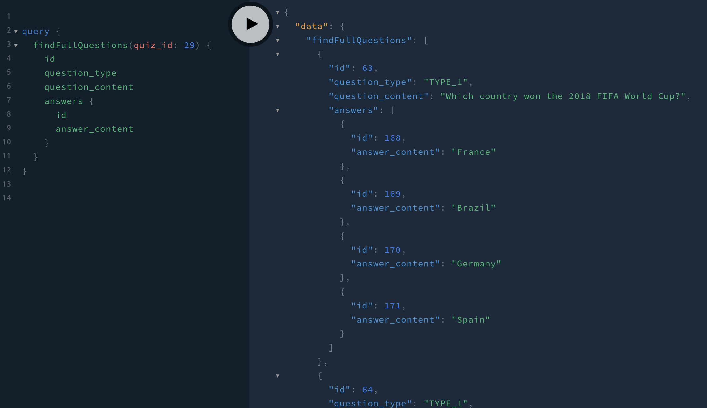
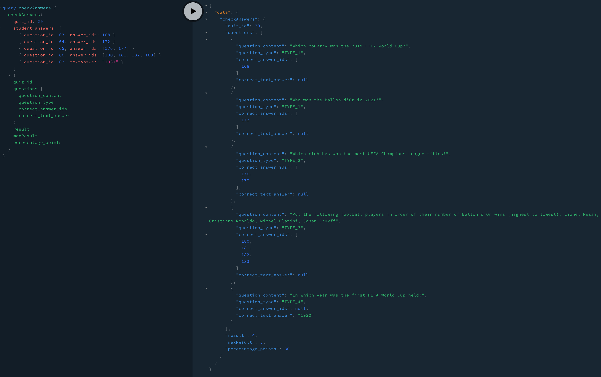

# Quiz API

## Getting Started

- Make sure that you have at leat 3.9 docker version

- Clone the repository and install the necessary dependencies 

```bash
$ git clone https://github.com/adriancielniak/quiz-api.git

$ npm install
 
$ ./install-dependencies.sh
```

## Running the app

```bash
# run local database
$ dokcer-compose up -d

# run api
$ npm run start:dev
```

## Test

```bash
# unit tests
$ npm run test

# e2e tests
$ npm run test:e2e

# test coverage
$ npm run test:cov
```

## Description

- The Quiz API serves the purpose of creating, retrieving, and checking quiz-related information. It utilizes GraphQL as its query language and TypeORM as the Object-Relational Mapping (ORM) library for database interactions.

- I chose the postgres relational database and designed the following data schema:

    

- Qustion types

    - TYPE_1 - Single Correct Answer

    - TYPE_2 - Multiple Correct Answers

    - TYPE_3 - Sorting

    - TYPE_4 - Plain Text Answer

- Quizzes will only store title. Questions will only store quiz id, question type which I presented and of course queston content. Answers will only store question id, answer content and two optional fields: is_correct to single and multiple correct answers and priority for sorting question type, plain text answer does not need these fields


## How to use API

- Creating new quiz - create and return new quiz

    

- Find all quizzes - return all available quizzes

    

- Find full questions - return full questions for the specific quiz

    

- Check student answers - student can prvoide answers and we can chose which information we want to see e.g. student result, perecntage student/correct answers

    

## Awailable queries and mutations

```
mutation {
  createQuiz(
    createQuizInput: {
      title: "new quiz"
      questions: [
        question_content: "content"
        question_type: "TYPE_1/2/3/4"
        answers: [
            { answer_content: "A" }
            { answer_content: "B" }
          ]
      ]
    }
  ) {
    id
    title
    questions {
      id
      question_content
      question_type
      answers {
        id
        answer_content
        is_correct
        priority
      }
    }
  }
}
```

```
query{
  findAllQuizzes{
    id
    title
  }
}
```

```
query checkAnswers {
  checkAnswers(
    quiz_id: 1
    student_answers: [
      { question_id: 1, answer_ids: [1, 2] }
      { question_id: 2, textAnswer: "219313" }
    ]
  ) {
    quiz_id
    questions {
      question_id
      question_content
      question_type
      student_answer_ids
      correct_answer_ids
      correct_text_answer
      student_text_answer
    }
    result
    maxResult
    perecentage_points
  }
}
```

```
query findQuiz {
  findQuiz(quiz_id:  1){
    id
    title
    questions{
      id
      question_type
      question_content
      answers{
        id
        answer_content
        is_correct
        priority
      }
    }
  }
}
```

```
query getAllQuestions (){
  getAllQuestions{
    id
	question_type
    question_content
    answers{
      id
      answer_content
      priority
      is_correct
    }
  }
}
```

```
query {
  findFullQuestions(quiz_id: 1) {
    id
    question_type
    question_content
    answers {
      id
      answer_content
    }
  }
}
```

## Support

Nest is an MIT-licensed open source project. It can grow thanks to the sponsors and support by the amazing backers. If you'd like to join them, please [read more here](https://docs.nestjs.com/support).

## Stay in touch

- Author - [Kamil Myśliwiec](https://kamilmysliwiec.com)
- Website - [https://nestjs.com](https://nestjs.com/)
- Twitter - [@nestframework](https://twitter.com/nestframework)

## License

Nest is [MIT licensed](LICENSE).

